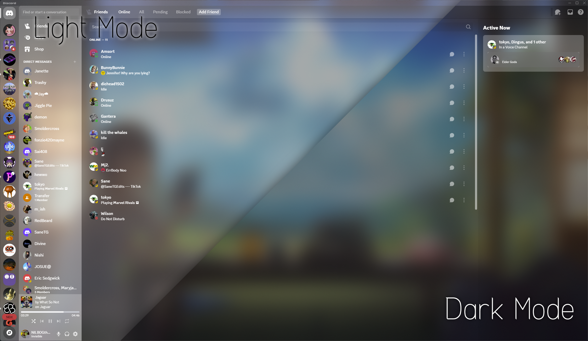
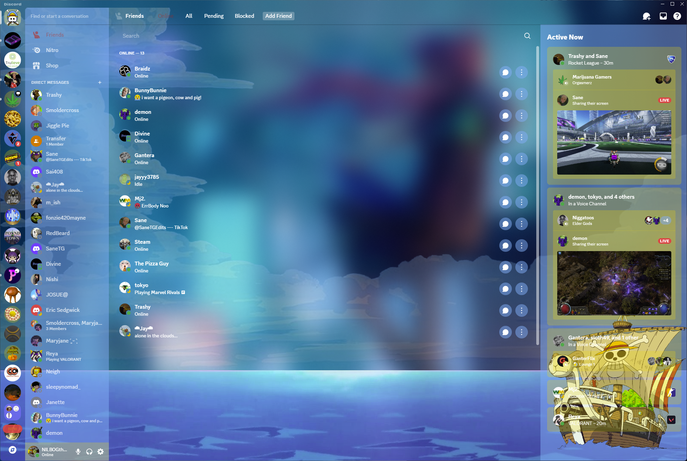

# NILBOG's Discord Themes

> [!WARNING]  
> This is still in beta. Product may not work as expected.

This repository contains my custom CSS profile for Discord, designed to transform the interface into a clean and aesthetically pleasing experience.

## Available Themes

#### NILBOG's Acrylic


#### One Piece
- [x] Transparent



## Install Instructions

### 1: Install Discord mod of your preference

- Install either Vencord, BetterDiscord, or Powercord.

   [[Vencord]](https://vencord.dev/)

   [[BetterDiscord]](https://betterdiscord.app/)

   [[Powercord]](https://betterdiscord.app/)

### 2: Install the theme pack

- #### Vencord
1. Open Vencord settings in Discord.
2. Navigate to **Themes**.
3. Paste the CSS from `themes/____.css` into the **Custom CSS** section.

- #### BetterDiscord
1. Download the `themes/____.css` file.
2. Place it in the BetterDiscord themes folder:
   - **Windows**: `%AppData%\BetterDiscord\themes`
   - **Mac/Linux**: `~/.config/BetterDiscord/themes`
3. Enable the theme in the BetterDiscord settings.

- #### Powercord
1. Clone this repository into your Powercord `themes` folder:
   ```bash
   git clone https://github.com/NILBOGtheSavior/NILBOGs-discord-themes.git ~/.powercord/themes/custom-css

## Background Blur

```Instructions coming soon```
