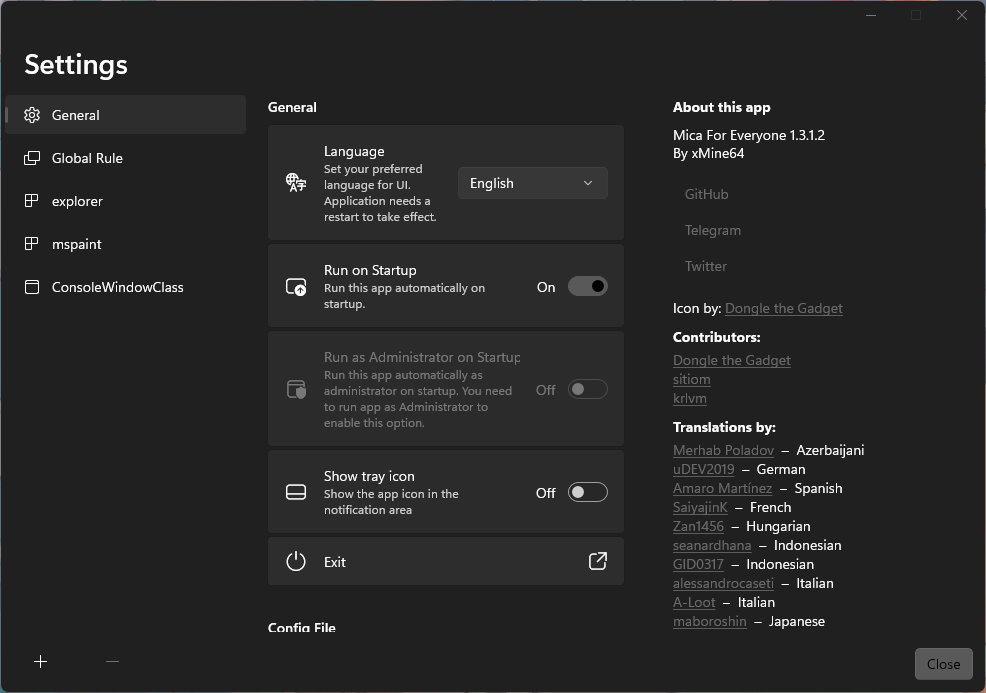
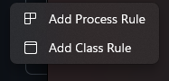
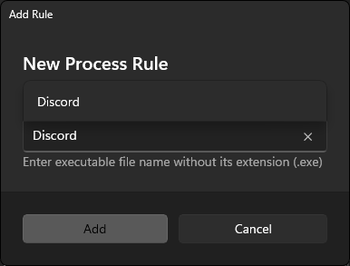
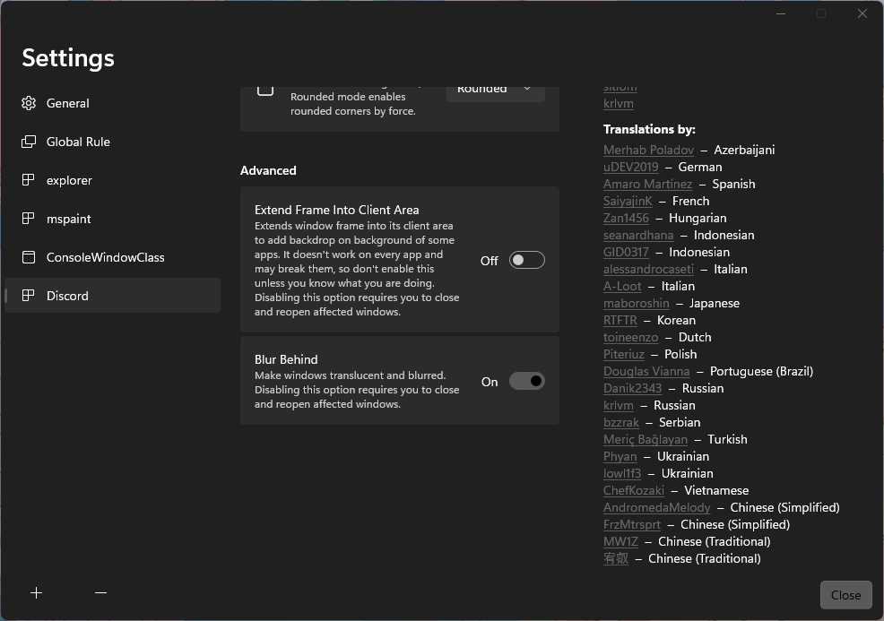

# NILBOGs-Discord-Themes


> [!WARNING]  
> This is still in beta. Themes may not work as expected.

This repository contains my custom CSS profile for Discord, designed to transform the interface into a clean and aesthetically pleasing experience.

## Available Themes
[[Preview Themes]](./themes.md)
### Standard Themes
- NILBOG's Acrylic
### Crossovers
- Razer
- One Piece

## Install Instructions

`Windows` `Mac` `Linux`

### 1: Install Discord mod of your preference

- Install either Vencord, BetterDiscord, or Powercord.

>    [Vencord](https://vencord.dev/)

>    [BetterDiscord](https://betterdiscord.app/)

>    [Powercord](https://betterdiscord.app/)

### 2: Install the theme pack

You may decide whether you would like to install the entire theme pack, or just a few.

- #### Vencord
1. Navigate to **User Settings > Vencord**
2. Check `Enable Custom CSS` and `Enable window transparency`. You may need to restart Discord.
3. Navigate to **Themes**.
4. Click on the `Open Themes Folder` button.
5. Move the `themes/____.css` files from this repository into the `Vencord/themes/` directory.
6. Enable the theme in the Vencord settings.

- #### BetterDiscord
1. Download the `themes/____.css` file.
2. Place it in the BetterDiscord themes folder:
   - **Windows**: `%AppData%\BetterDiscord\themes`
   - **Mac/Linux**: `~/.config/BetterDiscord/themes`
3. Enable the theme in the BetterDiscord settings.

- #### Powercord
1. Clone this repository into your Powercord `themes` folder:
   ```bash
   git clone https://github.com/NILBOGtheSavior/NILBOGs-discord-themes.git ~/.powercord/themes/custom-css

## Background Blur

`Windows` `Linux`

- ### Windows
1. Download [MicaForEveryone](https://github.com/MicaForEveryone/MicaForEveryone).
2. Launch the app and look through general settings. I recommend checking `Run on Startup`.

3. Click on the `+` button on the bottom left of the window, then on `Add Process Rule`. Enter **'Discord'** as the process name.
   - 
   - 
4. Turn `Blur Behind` on.
   - ***Optional:** Turn on `rounded edges`.*


- ### Linux
   #### Debian/Ubuntu
1. Install [GNOME Shell extensions](https://extensions.gnome.org/).
2. Install the [Blur my Shell](https://extensions.gnome.org/extension/3193/blur-my-shell/) extension.
3. Open the **Extensions** manager program, find `Blur my Shell` and click `Settings`.
4. Under `Applications > Whitelist`, click `+ Add Window` and select **Discord**.
